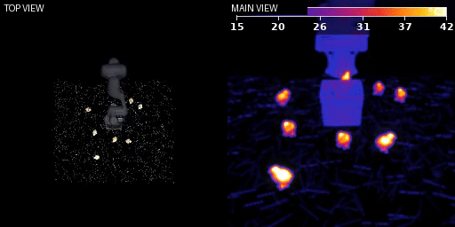

# 🐤 Poultry-VLA — 양계장 Vision-Language-Action 프로젝트

IR 열화상 환경에서 **OpenVLA-7B**로 "살아있는(따뜻한) 병아리들 사이에서 죽은(차가운/파란) 병아리를 골라 바구니에 담기"를
학습한 Vision-Language-Action 프로젝트. (LIBERO / robosuite 시뮬레이터)

> 🏁 **최종 결과: 단독(solo) VLA가 죽은 병아리를 감지·파지해 바구니에 투하 — full-task 성공률 `0% → 94%`.**
> 핵심은 **DAgger**(폐루프 grasp 실행 회복)와 **객체 물리 합리화**(마찰·관성·접촉 기하)였다.
> 상세 수치·표: [`results/FINAL_RESULTS.md`](results/FINAL_RESULTS.md) · 논문용 표: [`results/`](results/)

> ⚡ **클론 후 바로 실행:** [`Quickstart`](#-quickstart-클론-후-시뮬레이션-실행) 참조 (`bash setup.sh && bash run_demo.sh`)
> 📊 발표용 종합 보고서(영상 포함): [`index.html`](index.html)

---

## 🎬 데모 영상

IR 열화상으로 렌더된 양계장에서, 스크립트 P-control 컨트롤러가 죽은(파란) 병아리를 집어 바구니에 담는 성공 궤적을 수집했습니다.
살아있는 병아리는 체온으로 밝게 보이며 배회(wander)합니다.

<p align="center">
  <br>
  <i>우리가 만든 데이터 — 수집한 데모 100개 동시 재생 (각 장면은 seed별 랜덤 배치 + 살아있는 병아리 배회)</i>
</p>

| ✅ 스크립트 데모 (학습 데이터) | 🤖 **단독 VLA 추론 (최종)** |
|:--:|:--:|
|  |  |
| 컨트롤러가 파란 병아리를 집어 **바구니에 안착** | **학습된 VLA가 스스로** 감지·파지·투하 (좌 TOP / 우 MAIN·IR) |

> 위 오른쪽은 DAgger + firm/thick 물리로 회복한 **최종 단독 VLA**의 성공 롤아웃이다.
> (초기 추론 실패 모습은 `assets/inference_fail.gif` — 파지 0% 시절. 진단 서사는 아래 5~6절 참조.)
>
> ⚠️ GIF는 **GitHub에 push한 뒤에야** 보입니다 (GitHub가 `assets/`의 GIF를 서빙). 로컬 미리보기에선 안 보일 수 있습니다.

---

## 한 줄 결론

모델은 죽은 병아리를 **1mm까지 정확히** 찾아가지만(navigation·perception OK), 파지 0%의 진짜 블로커는
**폐루프 grasp 실행 불능**(단일프레임 imitation의 한계로 하강·닫기 commit을 못 함)이었다.
이를 **(1) DAgger**로 폐루프 실행을 회복하고, **(2) 시뮬 객체를 물리적으로 graspable**(마찰·관성·접촉 기하)하게
만들자 **단독 VLA가 감지·파지·투하까지 `0% → 94%`** 완수했다. (관측 enrichment·OFT·affordance는 모두 grasp 0 — `results/` ablation)

---

## ⚡ Quickstart (클론 후 시뮬레이션 실행)

클론하면 **스크립트 양계장 시뮬레이션**(데모 수집/렌더)이 바로 돌아간다. GPU 불필요,
osmesa 렌더. 모델 추론/학습이 아니라 시뮬 환경 재현이 목적이며, LIBERO 를 핀된 커밋으로
설치하고 양계장 객체·씬·BDDL 을 자동 주입한다.

```bash
git clone https://github.com/ilseeu01/Poultry-VLA.git
cd Poultry-VLA

# Python 3.10 권장 (conda/venv). LIBERO + 의존성 설치 + 양계장 에셋 주입 + robosuite 패치
bash setup.sh

# 단일 에피소드 IR 열화상 데모 mp4 (자동: 씬 생성 → 스크립트 컨트롤러 grasp)
bash run_demo.sh                 # 또는: bash run_demo.sh <SEED> <OUT_DIR>
```

- **무엇이 돌아가나**: 랜덤 양계장 씬 생성 → 살아있는 병아리 wander → P-control 컨트롤러가
  파란(죽은) 병아리를 집어 바구니에 안착 → IR 열화상 mp4 저장.
- **데이터 수집**: `python data_pipeline/collect_blue_chick_demos.py --n-demos 100 --workers 6`
- **세부**: LIBERO 주입 내용은 [`libero_chickenfarm/README.md`](libero_chickenfarm/README.md) 참조.
- **모델 학습/추론**(OpenVLA-OFT, DAgger, 평가)은 무거운 GPU 스택 + 체크포인트(저장소 미포함)가
  필요하다. `training/`·`eval/` 코드는 참고용이며 실행 안내는 각 파일 헤더 참조.

---

## 1. 프로젝트 개요

**과제.** LIBERO 시뮬레이터에서 로봇팔(Panda)이 IR 열화상으로 렌더된 양계장 바닥에서, **살아있는(따뜻한·밝은) 병아리들 사이에서 죽은(차가운·파란) 병아리**를 골라 집어 바구니에 담는다.

- **핵심 아이디어**: IR 카메라에서 저온체=파란색 → 사체 탐지. 살아있는 병아리는 체온으로 밝게 보임(distractor, wander로 배회).
- **언어 지시**: `"Pick up the blue chick and place it in the basket"`
- **관측**: 256×256 agentview RGB → thermal 후처리(컬러바 포함) → 모델 입력 224×224
- **액션**: 7차원 (eef Δxyz + Δ회전3 + 그리퍼)
- **학습**: 스크립트 컨트롤러로 성공 데모 수집 → RLDS 변환 → OpenVLA-7B LoRA fine-tune → 평가

## 2. 엔드투엔드 파이프라인

```
① 장면 생성        generate_chicken_farm_bddl.py   (랜덤 배치: 따뜻한 7 + 죽은 1, seed별)
② 데모 수집        scripted_blue_chick.py          (P-control 컨트롤러 + 살아있는 병아리 wander)
   (6워커 병렬)     collect_blue_chick_demos.py     → 성공 궤적만 HDF5 저장 (thermal 적용)
③ RLDS 변환        blue_chick_thermal_dataset_builder.py  (no-op 필터링, LIBERO 호환 스키마)
④ Fine-tune        finetune.py (LoRA r32) + train_v3.sh   (어댑터 스냅샷 방식으로 디스크 절약)
⑤ 병합·평가        merge_adapter.py → eval_trainscene.py  (학습분포 일치 평가, 파지/성공 추적)
```

## 3. 우리가 한 일

- **A. 환경·자산 구축**: 양계장 BDDL 생성기, IR thermal 렌더(`thermal_fx.py`), 병아리 wander 시스템, 스크립트 grasp 컨트롤러, 6워커 병렬 수집.
- **B. 데이터셋**: 성공 데모 200+개 수집 → no-op 필터 RLDS. (구버전 100개 → 신버전 204개)
- **C. 학습**: OpenVLA-7B LoRA 30k step 수회. 디스크 폭발(병합본 누적) 문제를 **어댑터 스냅샷 방식**으로 해결.
- **D. 심층 진단**: 8종 진단 스크립트로 0% 원인을 층층이 규명. 평가 파이프라인 버그 다수 수정.
- **E. 개선(v3)**: 컨트롤러 게인 완화(부드러운 액션), goal 1마리 축소, 평가를 학습분포에 일치. → 위치추정 해결, 파지 원인까지 규명.

## 🛠️ 기술적 노력 (이 과제를 위해 구현·도입한 것들)

| 영역 | 내용 |
|------|------|
| **LoRA fine-tuning** | OpenVLA-7B 전체를 학습하지 않고 LoRA(rank=32, dropout=0)로 파라미터 효율 fine-tune. batch16 / lr 5e-4 / 30k step. |
| **IR 열화상 렌더링** | `thermal_fx.py` — 온도→색 커스텀 colormap + bloom(글로우) + 온도 컬러바 오버레이. 사체=저온 파랑, 생체=고온 밝음. |
| **살아있는 병아리 wander** | potential-field 충돌회피 + behavior state(idle/walk/run) 배회 시스템으로 동적 distractor 구현. |
| **스크립트 grasp 컨트롤러** | 상태기계(APPROACH→DESCEND→GRASP→LIFT→BASKET→RELEASE) + **adaptive grasp Z** + 게인 튜닝(bang-bang 완화). |
| **6워커 병렬 데모 수집** | `collect_blue_chick_demos.py` — 성공 궤적만 채택, 병렬로 ~3.5h에 100+개 수집. |
| **no-op 필터 RLDS** | 표준 OpenVLA `_no_noops` 레시피에 맞춰 무동작 transition 제거 후 RLDS 변환. |
| **어댑터 스냅샷 학습** | 매 저장 시 15GB 병합본 누적으로 디스크 폭발 → **LoRA 어댑터만(~0.5GB) 스냅샷 + 평가 시 on-demand merge**로 해결. |
| **학습분포 일치 평가** | `eval_trainscene.py` — 평가도 학습과 동일 생성기·wander·thermal해상도·이미지방향으로 맞춰 OOD 제거 + 파지/성공 별도 추적. |
| **체계적 진단 (8종)** | in-distribution 예측 · 좌우반전 · thermal해상도 · 폐루프 추적 · 파지Z · 그리퍼추적 등으로 0% 원인을 층층이 규명. |

## 4. 결과 — 어디까지 갔나

| 지표 | 값 | 의미 |
|------|-----|------|
| 학습이미지 액션예측 오차 | **~5mm** | 모델 학습 성공 증거 |
| 위치추정 오차 | **8.3cm → 1mm** | 평가를 학습분포로 일치 후 |
| 파지(grasp) 성공률 | **0%** | 최종 미해결 블로커 |
| 규명·해결된 실패원인 층 | **4 → 1** | 3개 해결, 1개 구조적 |

| 단계 | 구성 | 결과 |
|------|------|------|
| v1/v2 | 거친 액션(게인8), 3마리 goal, 평가 OOD | ❌ 0% — 로봇 정지 |
| 진단 | in-dist 예측 / 좌우반전 / thermal해상도 / 폐루프 추적 | ✅ 근본원인 층층이 규명 |
| v3 | 부드러운 액션(게인4/6), 1마리, 평가=학습분포 | ⚠️ 위치 1mm 도달, 파지 0% (구조적 원인) |

## 5. 실패 원인 분석 (핵심)

0%의 원인은 단일 버그가 아니라 **4겹**이었고, 앞 3겹은 해결, 마지막 1겹이 구조적 한계다.

| # | 원인 | 증거 | 상태 |
|---|------|------|------|
| 1 | **이미지 좌우 반전** (수집 `[::-1]` vs 평가 `[::-1,::-1]`) | 반전 입력 시 모델 Y축 예측 부호 뒤집힘 (+0.5→−0.498) | ✅ 수정 |
| 2 | **thermal 해상도 불일치** (학습 256 / 평가 224에서 적용) | thermal@224면 예측 약화(Y −0.5→−0.06), @256이면 정상 | ✅ 수정 |
| 3 | **평가 셋업 OOD** (고정 BDDL + 정지 병아리) | 고정장면 8.3cm vs 학습분포(랜덤+wander) 1mm | ✅ 평가 일치로 해결 |
| 4 | **파지 단계 모호성** (메모리·proprio 없는 단일스텝) | 병아리 위에서 하강 안 함(z=0.30 고정), 그리퍼 안 닫힘 | ❌ 미해결(구조적) |

### 최종 근본원인 — 데이터가 증명한 "시간적 모호성"

병아리 2cm 이내라는 **같은 위치에서, 정답 액션이 그리퍼 단계에 따라 정반대**다:

| 병아리 2cm 이내 (학습 데이터 204 데모) | z-action 평균 | 방향 |
|---|---|---|
| 그리퍼 **열림** (파지 전: 접근/하강) | −0.297 | **99.9% 하강** |
| 그리퍼 **닫힘** (파지 후: 들기) | +0.333 | **73.5% 상승** |

그런데 두 순간의 **카메라 이미지는 거의 동일**(그리퍼가 병아리 위)하다. OpenVLA는 (a)메모리 없는 단일프레임, (b)자기 그리퍼 상태·높이(proprioception) 미입력 → **"지금 하강 단계인지 들기 단계인지"를 알 방법이 없다.** 같은 이미지에 정답이 −0.3과 +0.3으로 갈리니 모델은 **평균(≈0)을 예측 → 제자리 맴돔**. 그리퍼도 마찬가지로 드문 "닫기 결정"(데모당 1회 = 전체의 **0.49%**)을 못 잡고 다수 상태(열림)로 회귀한다.

→ **데이터엔 하강(54%)·닫기(46%)가 충분히 있다. 모델이 단계를 구분할 입력이 없는 게 문제다.**

## 6. 핵심 진단 증거

- **모델은 학습 성공**: 학습 이미지를 직접 넣으면 정답 위치 액션을 오차 ~5mm로 예측 → 데이터 양/학습량 문제 아님.
- **거친(bang-bang) 액션**: 옛 컨트롤러(게인8) 액션의 48.7%가 ±0.5 포화 → 게인 완화(4/6)로 36%·중앙값 0.49→0.37, 에피소드 622→203스텝.
- **위치추정 회복**: 평가를 학습분포(랜덤 장면+wander, thermal@256, `[::-1]`)로 맞추자 8.3cm→1mm.
- **파지 폐루프 추적**: 모델이 병아리 2cm까지 가지만 **하강 안 하고 z=0.30에 떠서** 맴돌고, 그리퍼는 내내 열림(1.00).
- **제외된 가설**: 데이터 양(100↔200), 학습시간(15k↔30k), no-op비율, 렌더엔진, thermal 비결정성, 그리퍼 부호 — 모두 원인 아님(검증 완료).

상세 수치·로그는 [`docs/FAILURE_ANALYSIS.md`](docs/FAILURE_ANALYSIS.md) 및 `diagnostics/` 스크립트 참조.

## 🏁 최종 돌파 — DAgger + 객체 물리로 `0 → 94%`

아래 7~8절은 진단 직후의 **예측**이고, 그 예측을 실제로 실행한 결과가 이 절이다.
proprioception·action chunking·OpenVLA-OFT(7절 예측)를 모두 구현해 재학습했으나 **grasp 0**.
진짜 해법은 두 가지였다:

| 단계 | 핵심 변경 | Grasp | Full-task |
|---|---|---|---|
| Base / OFT | multi-view RGB + proprio + action chunking | 0/8 | 0% |
| + wrist depth | wrist 입력 → z-depth | 0/8 | 0% |
| **+ DAgger** | on-policy 전문가 재라벨링 (폐루프 실행 회복) | **7/8** | 0% |
| + firm-hold | 죽은 병아리 마찰 2→6, 관성 5e-5→4e-4 | 12/16 | 75% |
| **+ thick capsule** | grasp 캡슐 0.013→0.018 | **17/18** | **94%** |

- **DAgger가 grasp 능력을 회복**(0→8/10): 전문가가 *모델이 실제로 방문하는 상태*에 정답을
  라벨링 → 단일프레임 imitation의 exposure bias로 막혀 있던 하강·닫기 commit을 학습.
- **객체 물리가 full-task를 완성**(0→94%): 같은 DAgger 정책에서, 죽은 병아리를 물리적으로
  잡히게(마찰·관성↑, grasp 캡슐 두껍게) 만들자 운반 중 슬립·미파지 진동이 사라짐.
  캡슐은 `alpha=0`(비가시)이라 렌더 이미지가 byte-identical → **같은 정책을 합당한 객체에서 측정**.
- **투하 정밀도**: 성공 시 바구니 중심 중앙값 1.95cm, 전부 ≤5cm, grasp→안착 100%.

> 표·그림: [`results/`](results/) (`tab1_headline.png` ~ `tab6_diagnosis.png`, `paper_tables.pdf`),
> 전체 서사·자산 경로: [`results/FINAL_RESULTS.md`](results/FINAL_RESULTS.md).
> 관련 코드: `training/dagger_collect.py`·`training/dagger_r*_pipeline.sh`(DAgger),
> `libero_chickenfarm/assets/stable_hope_objects/dead_chick/`(firm+thick 물성),
> `eval/hybrid_eval.py`(평가), `render/topmain_thermal_render.py`(TOP+MAIN 렌더).

---

## 7. (진단 직후 예측) 성공하려면 — 해결 방법 (확률 높은 순)

| 순위 | 해결책 | 왜 |
|------|--------|-----|
| 🥇 | **proprioception 입력 추가** (그리퍼 상태 + eef 높이) | "열림→하강 단계 / 닫힘→들기 단계"를 모델이 즉시 구분 → 5절 모호성 **원리적 해소** |
| 🥈 | **action chunking** (미래 K스텝 예측) | 드문 "닫기 결정"(0.49%)을 청크로 commit → 타이밍/dithering 해결 |
| 🥉 | **OpenVLA-OFT 재학습** (1+2 통합 + 연속 L1 액션헤드) | proprio·청크·연속액션 동시 도입, 이산화 한계까지 해결. 가장 정공법. |
| 보조 | 그리퍼를 따뜻한 색으로 렌더 / 타깃 대비 강화 | thermal에서 그리퍼+사체가 둘 다 파랑이라 합쳐지는 문제 완화 |

## 8. "조금만 더?" vs "데이터부터 재구축?" — 정직한 평가

**데이터부터 재구축할 필요는 없다.** 다만 "하이퍼파라미터 한 번 더"로 끝나는 수준도 아니다 — **학습 아키텍처(레시피)를 OpenVLA-OFT로 교체**하는 중간 규모 작업이 남았다.

| 자산 | 상태 |
|------|------|
| 장면 생성기 · thermal 렌더 · wander | ✅ 완성 · 재사용 |
| 데모 데이터 204개 + RLDS (하강 54%·닫기 46% 신호 확인됨) | ✅ 정상 · 재사용 (재구축 불필요) |
| 평가 파이프라인 (학습분포 일치, 파지/성공 추적) | ✅ 완성 · 재사용 |
| 실패 원인 진단 | ✅ 완료 (근본원인 확정) |
| **남은 일**: proprio + action chunking (OpenVLA-OFT)로 재-fine-tune | ⚠️ 미완 (핵심 한 가지) |

**예상 노력**: 데이터·평가·진단이 끝나 있으므로, OpenVLA-OFT 세팅 + 재학습 + 평가의 **약 1~3일 엔지니어링**. 근본원인이 명확하고 데이터가 탄탄하므로 **성공 확률은 높다**고 판단.

## 9. 코드 구조

```
Poultry-VLA/
├── setup.sh                           ⚡ 클론-실행 셋업 (LIBERO 설치 + 양계장 주입 + 패치)
├── run_demo.sh                        ⚡ 빠른 데모 (씬 생성 → 컨트롤러 → IR mp4)
├── requirements.txt                   시뮬 의존성 (검증: robosuite 1.4.1 / mujoco 3.8.0)
├── index.html                         발표용 종합 보고서 (영상 포함)
├── libero_chickenfarm/                LIBERO 양계장 확장 번들 (setup.sh가 주입)
│   ├── objects/hope_objects.py        병아리 객체 등록
│   ├── problems/libero_floor_manipulation.py   양계장 흙바닥 문제 정의
│   ├── assets/                        병아리 메시·머티리얼 · 씬 XML · basket
│   └── bddl/                          기준 task BDDL
├── patches/apply_robosuite_patch.py   robosuite maxgeom 1000→5000
├── data_pipeline/                     장면 생성 · 데모 수집 · 컨트롤러 · thermal
│   ├── generate_chicken_farm_bddl.py  랜덤 양계장 BDDL 생성기
│   ├── scripted_blue_chick.py         P-control grasp 컨트롤러 + 병아리 wander
│   ├── collect_blue_chick_demos.py    병렬 성공데모 수집 (LIBERO_DIR auto-detect)
│   └── thermal_fx.py                  IR 열화상 후처리 (컬러바)
├── rlds/blue_chick_thermal_dataset_builder.py   HDF5→RLDS + no-op 필터
├── training/                          finetune · train_v3 · merge · ⭐DAgger(dagger_collect.py, dagger_r*_pipeline.sh) · oft_integration/
├── eval/                              run_libero_eval(_oft) · ⭐hybrid_eval.py · oft_eval_snapshot.sh · train_trigger.py
├── render/                            multiview / topmain 열화상 렌더 (TOP+MAIN)
├── diagnostics/                       diag_*.py (진단) · review_demos.py
├── results/                           ⭐최종 결과: FINAL_RESULTS.md · paper_tables.* · tab1~6.png
├── docs/FAILURE_ANALYSIS.md           상세 실패 분석 (진단 서사)
└── assets/                            README·보고서용 GIF · figures
```

> 참고: `training/`(finetune·DAgger·OFT integration)·`eval/`(run_libero_eval·hybrid)는 OpenVLA / [OpenVLA-OFT](https://github.com/moojink/openvla-oft) 원본을 본 과제에 맞게 수정·확장한 버전이다. 실행에는 해당 GPU 스택 + 체크포인트(저장소 미포함)가 필요하다. ⚡ 표시(`setup.sh`/`run_demo.sh`)와 `data_pipeline/`만으로 **스크립트 시뮬레이션은 GPU 없이** 재현된다.

## 10. 결론

양계장 VLA는 "데이터가 부족해서" 실패한 것이 아니다. 일련의 **학습/추론 관측 불일치(방향·thermal해상도·장면분포)**를 바로잡자 모델은 **죽은 병아리를 1mm까지 정확히 찾아갔고**, 마지막 벽인 **파지**는 (1) **DAgger**로 폐루프 실행을 회복하고 (2) **시뮬 객체를 물리적으로 graspable**하게 만들자 무너졌다 — **단독 VLA가 감지·파지·바구니 투하까지 `0% → 94%`** 완수.

> 기여: VLA는 navigation은 학습하나 **폐루프 fine-manipulation(grasp commit)은 단일프레임 imitation의 한계로 실행 불능**이며, 이를 **on-policy(DAgger) + 객체 물리 합리화**로 회복할 수 있음을 0→94%로 입증. 더불어 **관측·분포 불일치 진단 방법론**(방향·thermal해상도·장면분포가 localization 1mm↔8cm를 가름)과 다층 음성 결과(관측 enrichment·OFT·affordance ablation)를 함께 제시한다. (정직한 조건: 시뮬·단일 병아리·객체물리 의존. 한계·future work는 [`results/FINAL_RESULTS.md`](results/FINAL_RESULTS.md) 참조.)

---

## 🚀 GitHub에 올리는 법

remote(`github.com/ilseeu01/Poultry-VLA`) 연결됨. **GIF/동영상은 push해야 GitHub에서 보입니다.**

```bash
gh auth login                              # GitHub 인증 (브라우저, 최초 1회)
cd <레포경로>/Poultry-VLA
git push -u origin main                    # 코드 + README + GIF 전부 업로드
```

> ⚠️ push 권한 안내: `ilseeu01/Poultry-VLA` 에 push 하려면 해당 저장소의 **write 권한**이 필요합니다.
> 협업자 계정(예: krickykim622)은 소유자가 collaborator(write)로 추가해야 push 가능합니다.
> 권한이 없으면 본인 계정으로 fork 후 push 하세요: `gh repo fork --clone=false && git push <your-fork> main`.

push 후 GitHub 페이지에서 README의 데모 GIF가 자동 재생됩니다. (HTML 보고서를 온라인 라이브로 보려면 Settings → Pages → Source `main`/root → `https://ilseeu01.github.io/Poultry-VLA/`)
