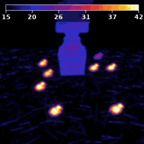
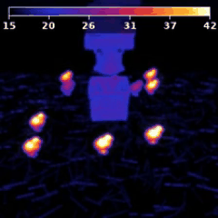

# 🐤 Poultry-VLA

IR 열화상 환경에서 **OpenVLA-7B**로 "살아있는(따뜻한) 병아리들 사이에서 죽은(차가운/파란) 병아리를 골라 바구니에 담기"를
학습한 Vision-Language-Action 프로젝트. (LIBERO / robosuite 시뮬레이터)

> 📊 **발표용 종합 보고서: [`index.html`](index.html)** 를 브라우저로 열어보세요.

---

## 🎬 우리가 만든 데이터 (스크립트 컨트롤러 데모 200+개)

IR 열화상으로 렌더된 양계장에서, 스크립트 P-control 컨트롤러가 죽은(파란) 병아리를 집어 바구니에 담는 성공 궤적을 수집했습니다.
살아있는 병아리는 체온으로 밝게 보이며 배회(wander)합니다.

<p align="center">
  <br>
  <i>수집한 데모 100개 동시 재생 (각 장면은 seed별 랜덤 배치 + 살아있는 병아리 배회)</i>
</p>

| ✅ 성공 데모 (학습 데이터) | ❌ 실패한 추론 (학습된 모델) |
|:--:|:--:|
|  |  |
| 컨트롤러가 파란 병아리를 집어 **바구니에 안착** | 모델은 병아리 위 1mm까지 가지만 **하강·파지를 못 함** |

---

## 한 줄 요약

데이터·평가 파이프라인은 정상이며 모델은 죽은 병아리를 **1mm까지 정확히** 찾아간다.
최종 실패(파지 0%)는 데이터 부족이 **아니라**, OpenVLA가 메모리·자기상태(proprioception) 없는 단일프레임 정책이라
**"하강 단계 vs 들기 단계"를 구분하지 못해** 병아리 위에서 평균(제자리)을 예측하는 **구조적 한계**다.
→ **데이터 재구축 불필요. proprioception + action chunking(OpenVLA-OFT)로 학습 레시피만 교체하면 된다.**

---

## 🛠️ 기술적 노력 (이 과제를 위해 구현·도입한 것들)

| 영역 | 내용 |
|------|------|
| **LoRA fine-tuning** | OpenVLA-7B 전체를 학습하지 않고 LoRA(rank=32, dropout=0)로 파라미터 효율 fine-tune. batch16 / lr 5e-4 / 30k step. |
| **IR 열화상 렌더링** | `thermal_fx.py` — 온도→색 커스텀 colormap + bloom(글로우) + 온도 컬러바 오버레이. 사체=저온 파랑, 생체=고온 밝음. |
| **살아있는 병아리 wander** | potential-field 충돌회피 + behavior state(idle/walk/run) 배회 시스템으로 동적 distractor 구현. |
| **스크립트 grasp 컨트롤러** | 상태기계(APPROACH→DESCEND→GRASP→LIFT→BASKET→RELEASE) + **adaptive grasp Z** + 게인 튜닝(bang-bang 완화). |
| **6워커 병렬 데모 수집** | `collect_blue_chick_demos.py` — 성공 궤적만 채택, 병렬로 ~3.5h에 100+개 수집. |
| **no-op 필터 RLDS** | 표준 OpenVLA `_no_noops` 레시피에 맞춰 무동작 transition 제거 후 RLDS 변환. |
| **어댑터 스냅샷 학습** | 매 저장 시 15GB 병합본 누적으로 디스크 폭발 → **LoRA 어댑터만(~0.5GB) 스냅샷 + 평가 시 on-demand merge**로 해결. |
| **학습분포 일치 평가** | `eval_trainscene.py` — 평가도 학습과 동일 생성기·wander·thermal해상도·이미지방향으로 맞춰 OOD 제거 + 파지/성공 별도 추적. |
| **체계적 진단 (8종)** | in-distribution 예측 · 좌우반전 · thermal해상도 · 폐루프 추적 · 파지Z · 그리퍼추적 등으로 0% 원인을 층층이 규명. |

---

## ❓ 실패 원인 (4겹: 앞 3겹 해결 / 마지막 1겹 구조적)

| # | 원인 | 상태 |
|---|------|------|
| 1 | 이미지 좌우 반전 (수집 `[::-1]` vs 평가 `[::-1,::-1]`) | ✅ 수정 |
| 2 | thermal 해상도 불일치 (학습 256 / 평가 224) | ✅ 수정 |
| 3 | 평가 셋업 OOD (고정 BDDL + 정지 병아리) → 위치오차 8cm | ✅ 평가 일치로 1mm |
| 4 | **파지 단계 모호성** (메모리·proprio 없는 단일스텝) | ❌ 미해결(구조적) |

**근거(데이터):** 병아리 2cm 이내 같은 위치에서 그리퍼 열림→z −0.30(하강 99.9%), 닫힘→z +0.33(상승 73.5%).
이미지는 거의 동일 → 모델이 단계를 못 구분해 평균(제자리) 예측. (닫기 '결정'은 데모당 1회=전체의 0.49%로 극히 드뭄)

---

## 📁 코드 구조

```
data_pipeline/   장면 생성 · 데모 수집(6워커) · 컨트롤러 · IR thermal
rlds/            HDF5→RLDS + no-op 필터
training/        finetune.py(어댑터 스냅샷) · train_v3.sh · merge_adapter.py
eval/            run_libero_eval.py(수정) · eval_trainscene.py(학습분포 평가) · eval_ckpt.sh
diagnostics/     diag_*.py 8종 · review_demos.py
docs/            FAILURE_ANALYSIS.md (상세 분석)
assets/          README용 GIF
```

## ✅ 다음 단계 (성공 경로)

1. **proprioception 입력 추가** (그리퍼 상태 + eef 높이) — 단계 모호성 원리적 해소
2. **action chunking** (미래 K스텝 예측) — 드문 파지 결정 commit
3. **OpenVLA-OFT 재학습** (1+2 + 연속 L1 액션헤드 통합)

데이터(204 데모 + RLDS)·평가·진단은 완성되어 재사용 가능. **데이터 재구축 불필요**, 남은 건 학습 레시피 교체(약 1~3일).

> 실행에는 [OpenVLA](https://github.com/openvla/openvla)·[LIBERO](https://github.com/Lifelong-Robot-Learning/LIBERO) 환경 필요.
> `training/finetune.py`, `eval/run_libero_eval.py`는 OpenVLA 원본을 본 과제에 맞게 수정한 버전.
